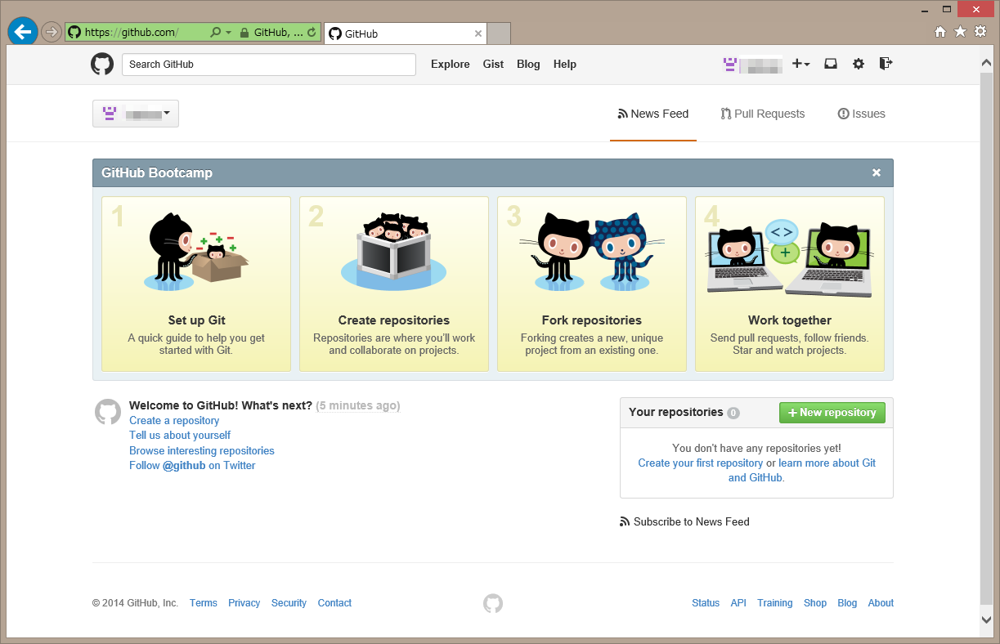
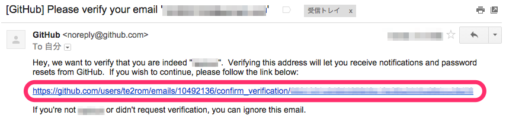
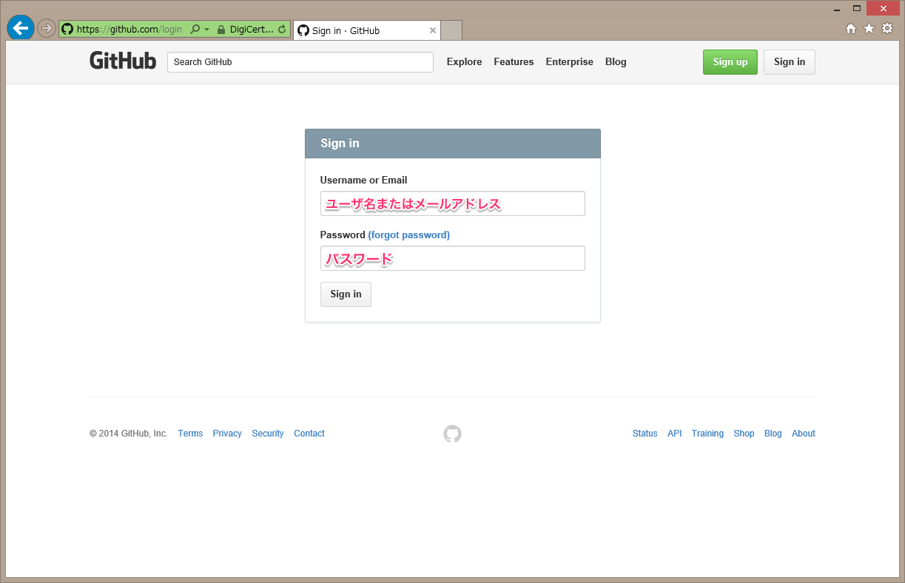
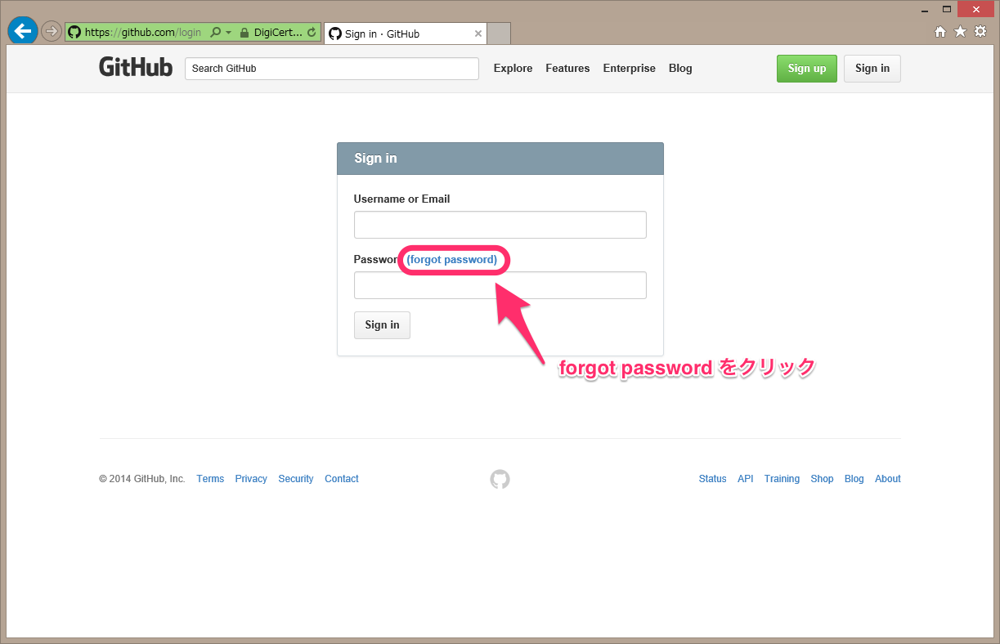
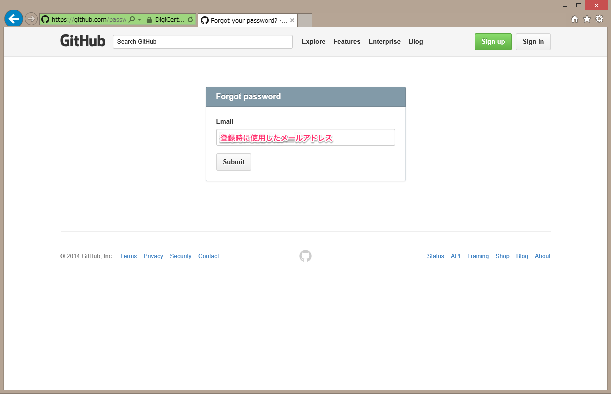
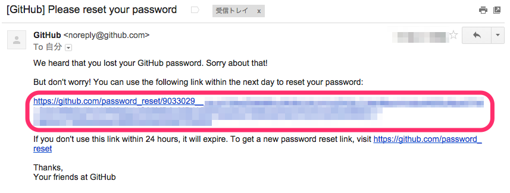
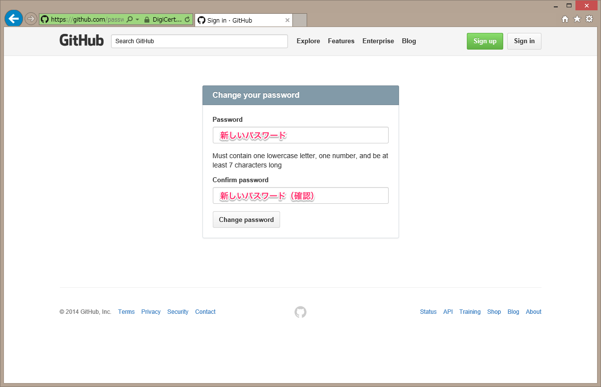

# GitHub利用マニュアル

## はじめに
本システムではユーザ認証にGitHubアカウントを使用しています。
課題の提出にはGitHubアカウントによるログインが必要になります。

GitHubアカウントをお持ちでない場合は、以下の手順に従ってアカウントを作成してください。
すでにアカウントをお持ちの場合は、この作業は必要ありません。		

## GitHubへのユーザ登録

[GitHub](https://github.com/)へアクセスしてください。

GitHubのトップページが表示されたら、ユーザ情報を入力してください。

* ユーザ名、パスワードは自由に決めてください
* メールアドレスは、学生用アドレスでも個人のアドレスでも構いません。ただし、携帯電話のキャリアメールアドレスを使用しないでください
* 意味がわからない場合は大学から配布されたメールアドレスを使用してください	

ユーザ名とパスワードは演習に必要になるため、忘れないようにしてください。

すべて入力したら、Sign up for GitHub をクリックしてください。クリックすると次の画面に移動します。

この画面では料金プランを選択します。

  * Free(無料)を選択してください
  * Help me set up an organization next のチェックは不要です

確認したらFinish sign upをクリックしてください。クリックすると次の画面に移動します。

この画面（ホーム画面）が表示されたらGitHubへのユーザ登録は完了です。次回以降、GitHubアクセスすると、直接ホーム画面に移動します。	

## メールアドレスの確認
ユーザ登録が終わると、次のようなメールが登録時に入力したメールアドレス宛に届きます。
その際は、本文中のリンクをクリックしてください。

## GitHubへのサインイン

GitHubでは基本的に自動でサインイン（ログイン）が行われますが、別のPCを使用した場合など、例外もあります。
その場合は以下の手順でサインインします。

右上の Sign in ボタンをクリックします。

Sign in ボタンをクリックするとユーザ情報を入力する画面になります。
登録時に使用したユーザ名またはメールアドレスと、パスワードを入力し、Sign inをクリックしてください。

サインインに成功するとホーム画面に移動します。	

## パスワードの再発行
GitHubは米GitHub, Inc社の運営するサービスです。ユーザ名やパスワードを忘れてしまった場合、こちらで再発行することはできません。
以下の手順に従って、自分で再発行手続きを行ってください。

サインイン画面にforgot password というリンクがあるので、クリックします。

メールアドレスを入力する画面になるので、登録時に使用したメールアドレスを入力し、Submitをクリックしてください。

**登録時に使用したメールアドレスを忘れた場合、再発行はできません。**

入力したメールアドレス宛にメールが届きます。

メール本文中のリンクをクリックしてください。このリンクの有効期限は24時間です。過ぎてしまった場合は、もう一度やり直します。

メール本文中のリンクをクリックすると、新しいパスワードの設定画面に移動します。
新しいパスワードを2回入力し、Change passwordをクリックしてください。成功するとサインイン画面に移動するので、新しいパスワードでサインインしてください。	

パスワードは、1文字以上の英小文字と1文字以上の数字を含み、全体で7文字以上である必要があります。
