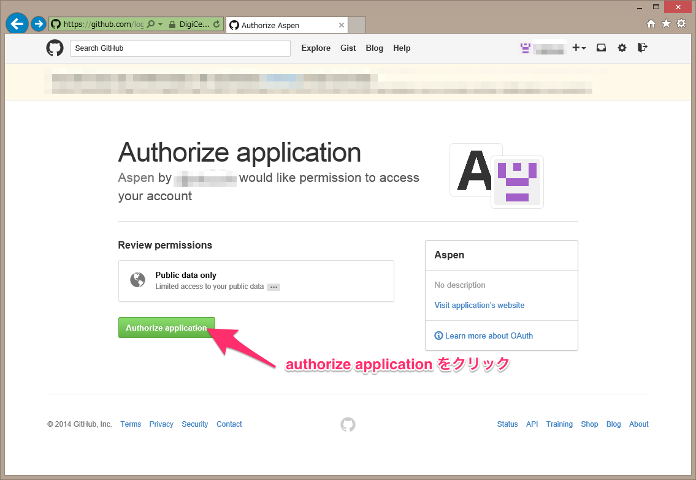
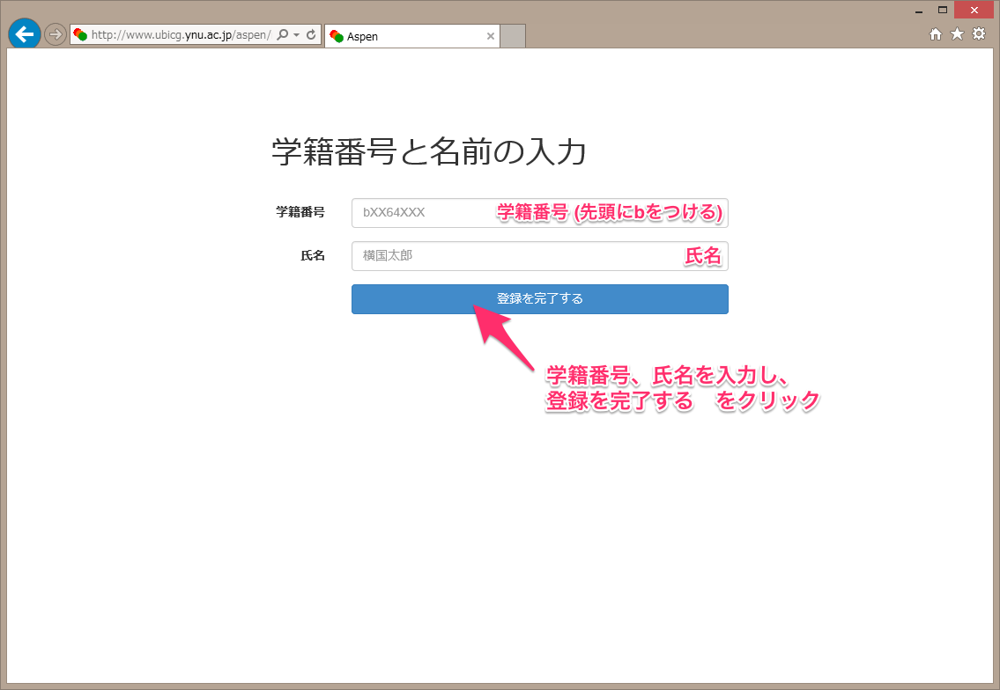
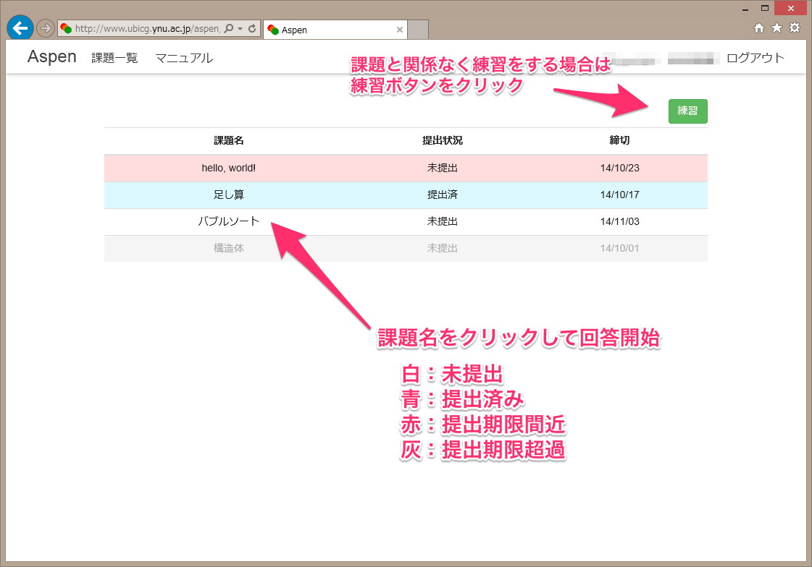
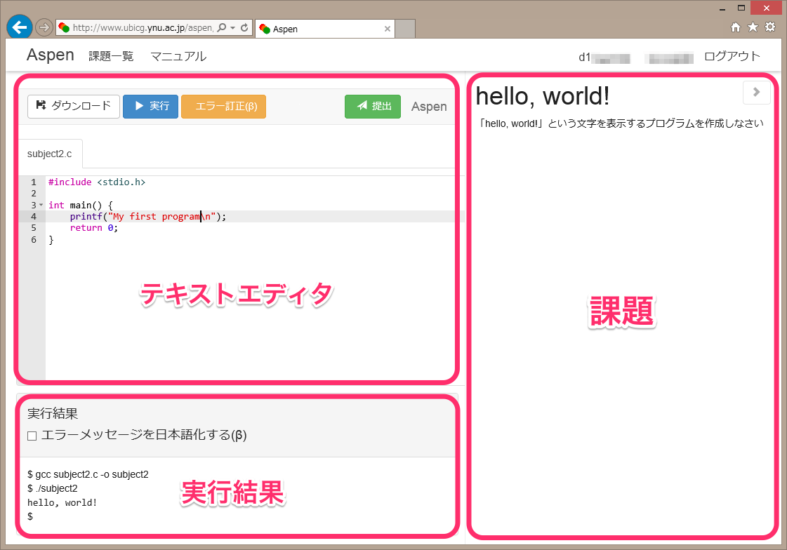

# Aspen利用マニュアル

## はじめに
[Aspen](http://www.ubicg.ynu.ac.jp/aspen/)は横浜国立大学倉光研究室で開発された、Webブラウザ上で動作するC言語演習システムです。
C言語プログラムの記述、実行、課題の提出という、プログラミング演習で必要な機能がすべてWebブラウザ上で利用できます。

## 特徴
### インストール不要
一般的に、プログラミングを行うための開発環境の構築は、初学者には大変な作業です。しかし、AspenはWebブラウザ上で動作するため、特別なソフトウェアをインストールすることなく利用できます。

### マルチプラットフォーム
AspenはWebブラウザが動作する環境であれば、プラットフォームを問わず利用できます。Windows、OS X、Linuxのほか、タブレット端末でも動作します。もちろん、演習室だけでなく自宅でも利用できます。

### オールインワン
問題文の参照、回答プログラムの作成、プログラムの実行、ファイルの保存、課題の提出が、すべてAspen上で完結します。演習にあたって他のソフトウェアを使用する必要はありません。

## Aspenへのユーザ登録
Aspenでは、ユーザ認証に[GitHub](https://github.com/)アカウントを使用しています。
GitHubアカウントをお持ちでない場合は、先にGitHubへのアカウント作成を行ってください。

* [GitHubアカウント作成手順](../github/index.html)

GitHubアカウントを用意したら、[Aspen](http://www.ubicg.ynu.ac.jp/aspen/)へアクセスしてください。

Aspenのトップページが表示されたら、「ログイン・新規登録」をクリックします。

AspenとGitHubを連携させる許可を求める画面が表示されます。「authorize application」をクリックしてください。

**GitHubからログアウトしている場合は、GitHubへのログインを求められます。その場合は、GitHubのユーザ名とパスワードを入力してください。**

GitHubとの連携の設定が成功すると、追加のユーザ情報を入力する画面になります。
自分の学籍番号と氏名を入力してください。

* 学籍番号はbから始めてください
* 氏名は、スペースを入れても入れなくてもかまいません

これらの情報は、課題の採点結果を成績に反映させるために必要です。
**間違えて入力すると単位が出ません**。

なお、学籍番号と氏名はGitHubを含む外部へ送信されることはありません。

「登録を完了する」をクリックするとホーム画面に移動します。

## ホーム画面

ホーム画面では課題の達成状況が一覧できます。提出済みの課題は青、提出期限が迫っている課題は赤、提出期限を過ぎてしまった課題は灰色で表示されます。
課題名をクリックすると、編集画面に移動します。

* 課題は演習毎に順次追加されます
* 赤になっている課題があるときは、優先的に取り組みましょう
* 提出期限を過ぎても提出そのものは可能です。過ぎてしまってもできるだけ提出してください

課題以外に自主的に練習をする場合や、試してみたいプログラムがある場合は、練習ボタンをクリックしてください。

## 編集画面

編集画面にはテキストエディタ、実行結果、課題が表示されます。

### テキストエディタ
ここにプログラムを入力します。入力した内容は自動的に保存され、ページを移動したりブラウザを終了したりしても消えることはありません。データはサーバ上に保存されるので、別のコンピュータで続きを作成することも可能です。

**実行ボタン**
をクリックすると、プログラムのコンパイルと実行が行われます。コンパイルに失敗した場合はエラーメッセージ、成功した場合はプログラムの実行結果が、それぞれエディタの下にある実行結果の欄に表示されます。

**提出ボタン**
をクリックすると、その時点のプログラムを提出します。何度でも提出することができますが、採点されるのは、それぞれの課題について
**最後に提出したもの**
になります。

**ダウンロードボタン**
をクリックすると、テキストエディタの内容をコンピュータ上にダウンロードできます。プログラムをメールで送信する場合や、Aspen以外のC言語コンパイラを使用して実行したい場合などに利用します。

**エラー訂正ボタン**
をクリックすると、エラーを訂正したプログラムを課題欄内に表示します。エラーを直す際の参考にしてください。

### 実行結果
エラーメッセージまたはプログラムの実行結果が表示されます。「エラーメッセージを日本語化する」にチェックを入れると、エラーメッセージを翻訳して表示します。ただし、翻訳機能は開発途中であるため、翻訳されないメッセージもあります。そのような例は是非ご報告下さい。

### 課題
課題の内容が表示されます。この条件をみたすプログラムを作成してください。
課題と関係のないファイルを編集している場合、課題欄は表示されません。

### 編集を終えるには
編集を終えるには、以下のいずれかの操作を行ってください。編集した内容は自動的に保存され、次回同じ課題またはファイルを開いた時は続きから編集できます。
* ブラウザの戻るボタンをクリックする
* ブラウザのタブを閉じる
* 画面上のメニューで別の画面へ移動する

